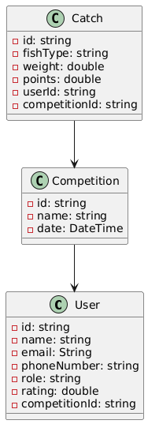
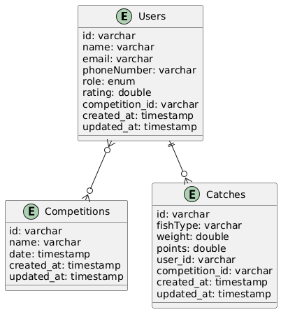

# Консольное приложение **FishMatch**
***
Данный проект был разработан в рамках дисциплины _"Архитектура информационных систем"_.
***
## Для проектирования системы были составлены следующие UML-диаграммы:

- **Диаграмма вариантов использования**:  
  .png)

- **Диаграмма классов**:  
  

- **Диаграмма базы данных**:  
  
***
## Описание проекта

В проекте реализовано логирование, что позволяет фиксировать ключевые операции, ошибки и другие важные события. Это помогает контролировать выполнение задач и упрощает диагностику при возникновении проблем.

Реализована поддержка работы с различными форматами данных, включая **CSV**, **XML** и **Properties**, что обеспечивает гибкость при интеграции системы с другими сервисами и упрощает обработку внешних данных.

**MongoDB** используется для хранения и управления данными, обеспечивая удобную работу с документно-ориентированной моделью данных.

**PostgreSQL** подключена через JDBC, что обеспечивает возможность работы с реляционными данными, включая сложные запросы и использование транзакций.
Для каждой модели данных были разработаны и реализованы **CRUD-операции** (создание, чтение, обновление и удаление). Это позволяет эффективно управлять данными и взаимодействовать с ними в рамках системы. Также для каждой модели разработаны диаграммы классов, наглядно отображающие их структуру и взаимосвязи.
***
## Функциональность

Проект представляет собой систему для организации и управления **рыболовными соревнованиями**. Включает функциональность для:

- Регистрации пользователей (участников и организаторов)
- Создания соревнований
- Учет уловов участников

Пользователи могут быть зарегистрированы для участия в соревнованиях, а организаторы — управлять ими и анализировать результаты. Вся информация сохраняется в базе данных, и доступ к данным осуществляется через командный интерфейс, где можно:

- Создавать
- Редактировать
- Удалять записи о пользователях, соревнованиях и уловах
***
Вот описание с примерами команд CLI в текстовом виде:

---

### **Интерфейс командной строки для управления соревнованиями, пользователями и уловами**

Это приложение позволяет управлять соревнованиями, пользователями и уловами в рыболовном соревновании. С помощью командной строки вы можете создавать, обновлять, просматривать и удалять записи о соревнованиях, пользователях и их уловах.

#### **Основные команды:**

1. **Управление соревнованиями:**

      ```
      1. Создать соревнование
      ```
      Пример:
      ```
      Название соревнования: Чемпионат по рыбалке
      Дата соревнования (гггг-мм-дд чч:мм): 2025-03-10 12:00
      ```
      Это создаст новое соревнование с указанным названием и датой.


2. **Просмотреть соревнование:**
      ```
      2. Просмотреть соревнование
      ```
      Пример:
      ```
      Введите ID соревнования: 6bf31183-f9dd-49de-b66e-fb3c896051dd
      ```
      Покажет данные соревнования с ID 6bf31183-f9dd-49de-b66e-fb3c896051dd, если оно существует.


3. **Обновить соревнование:**
      ```
      3. Обновить соревнование
      ```
      Пример:
      ```
      Введите ID соревнования: 6bf31183-f9dd-49de-b66e-fb3c896051dd
      Новое название (текущее: Чемпионат по рыбалке): Сезонный чемпионат по рыбалке
      Новая дата (текущая: 2025-03-10 12:00): 2025-03-12 14:00
      ```
      Это обновит данные соревнования с ID 6bf31183-f9dd-49de-b66e-fb3c896051dd.


4. **Удалить соревнование:**
      ```
      4. Удалить соревнование
      ```
      Пример:
      ```
      Введите ID соревнования: 6bf31183-f9dd-49de-b66e-fb3c896051dd
      ```
      Это удалит соревнование с указанным ID.


5.  **Управление пользователями:**

      ```
      1. Создать пользователя
      ```
      Пример:
      ```
      Имя: Иван Иванов
      Электронная почта: ivan@mail.com
      Номер телефона: 1234567890
      Роль (ORGANIZER/PARTICIPANT): PARTICIPANT
      Рейтинг (0.00 - 9.99): 8.5
      ID соревнования: 6bf31183-f9dd-49de-b66e-fb3c896051dd
      ```
      Это создаст нового пользователя с указанными данными.


6. **Просмотреть пользователя:**
      ```
      2. Просмотреть пользователя
      ```
      Пример:
      ```
      Введите ID пользователя: 3daa4335-6de6-4049-971e-cff6e51ab5b9
      ```
      Покажет данные пользователя с ID 3daa4335-6de6-4049-971e-cff6e51ab5b9.


7.  **Обновить пользователя:**
      ```
      3. Обновить пользователя
      ```
      Пример:
      ```
      Введите ID пользователя: 3daa4335-6de6-4049-971e-cff6e51ab5b9
      Новое имя (текущее: Иван Иванов): Сергей Сергеев
      Новый Email (текущий: ivan@mail.com): sergey@mail.com
      ```
      Это обновит данные пользователя с ID 3daa4335-6de6-4049-971e-cff6e51ab5b9.


8. **Удалить пользователя:**
      ```
      4. Удалить пользователя
      ```
      Пример:
      ```
      Введите ID пользователя: 3daa4335-6de6-4049-971e-cff6e51ab5b9
      ```
      Это удалит пользователя с указанным ID.


9. **Управление уловами:**

      ```
      1. Создать улов
      ```
      Пример:
      ```
      Вид рыбы: Щука
      Вес: 5.4
      Очки: 10.0
      ID пользователя: 3daa4335-6de6-4049-971e-cff6e51ab5b9
      ID соревнования: 6bf31183-f9dd-49de-b66e-fb3c896051dd
      ```
      Это создаст новый улов с указанными данными.


10. **Просмотреть улов:**
      ```
      2. Просмотреть улов
      ```
      Пример:
      ```
      Введите ID улова: 717ec3cc-2c85-4938-8772-9211ea64a5ec
      ```
      Покажет данные улова с ID 789.


11.  **Обновить улов:**
      ```
      3. Обновить улов
      ```
      Пример:
      ```
      Введите ID улова: 717ec3cc-2c85-4938-8772-9211ea64a5ec
      Новый вид рыбы (текущий: Щука): Лещ
      Новый вес (текущий: 5.4): 6.2
      Новые очки (текущие: 10.0): 12.0
      ```
      Это обновит данные улова с ID 717ec3cc-2c85-4938-8772-9211ea64a5ec.


12.  **Удалить улов:**
      ```
      4. Удалить улов
      ```
      Пример:
      ```
      Введите ID улова: 717ec3cc-2c85-4938-8772-9211ea64a5ec
      ```
      Это удалит улов с указанным ID.

#### **Другие команды:**

- **Посмотреть все соревнования:**
  ```
  5. Посмотреть все соревнования
  ```
  Покажет список всех существующих соревнований.


- **Посмотреть всех пользователей:**
  ```
  5. Посмотреть всех пользователей
  ```
  Покажет список всех зарегистрированных пользователей.


- **Посмотреть все уловы:**
  ```
  5. Посмотреть все уловы
  ```
  Покажет список всех уловов.


- **Вернуться в главное меню:**
  ```
  6. Вернуться в главное меню
  ```
  Возвращает вас в главное меню для выбора другой операции.

#### **Завершение работы:**
Для выхода из приложения используйте команду:
```
4. Выйти
```


Этот интерфейс предоставляет полный набор команд для работы с системой рыболовных соревнований.
***
Спасибо за внимание! Удачи!
***
## Контакты:

- **Телеграмм**: [@danisimo_vers](https://t.me/danisimo_vers)

